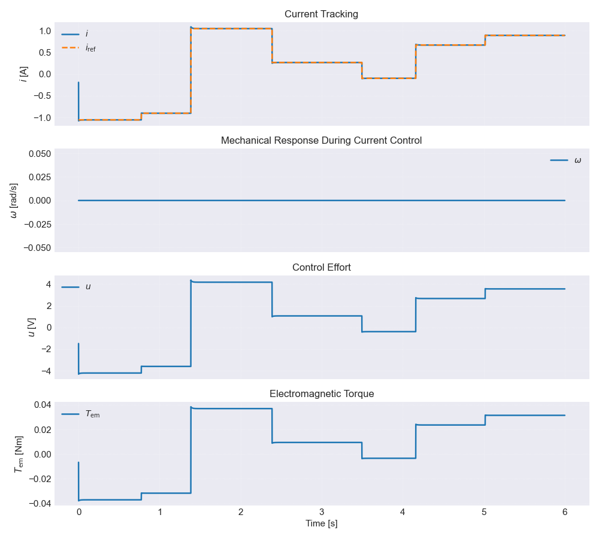
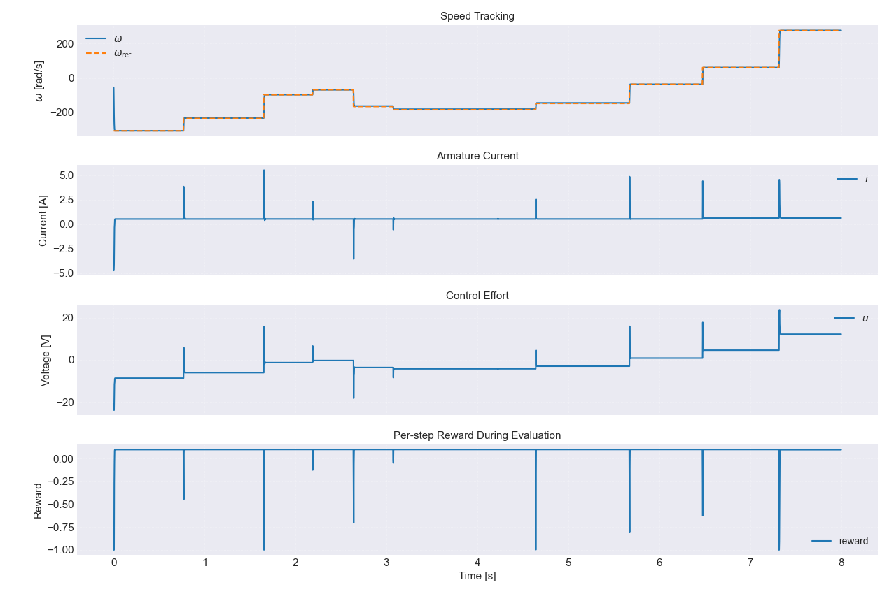
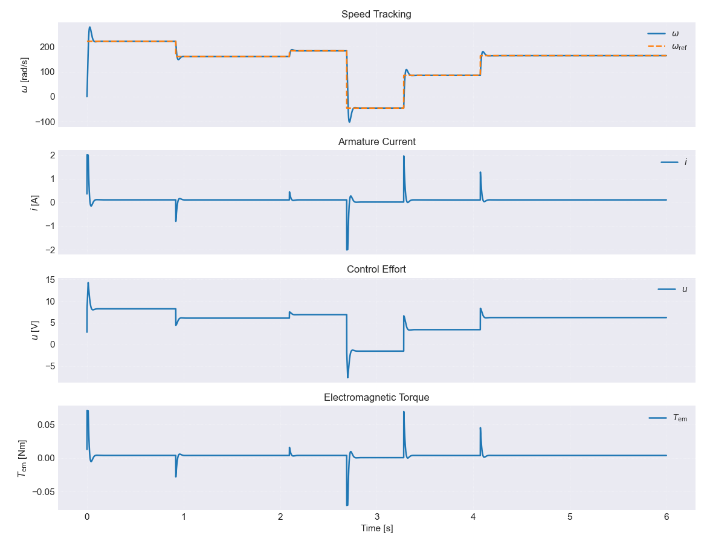
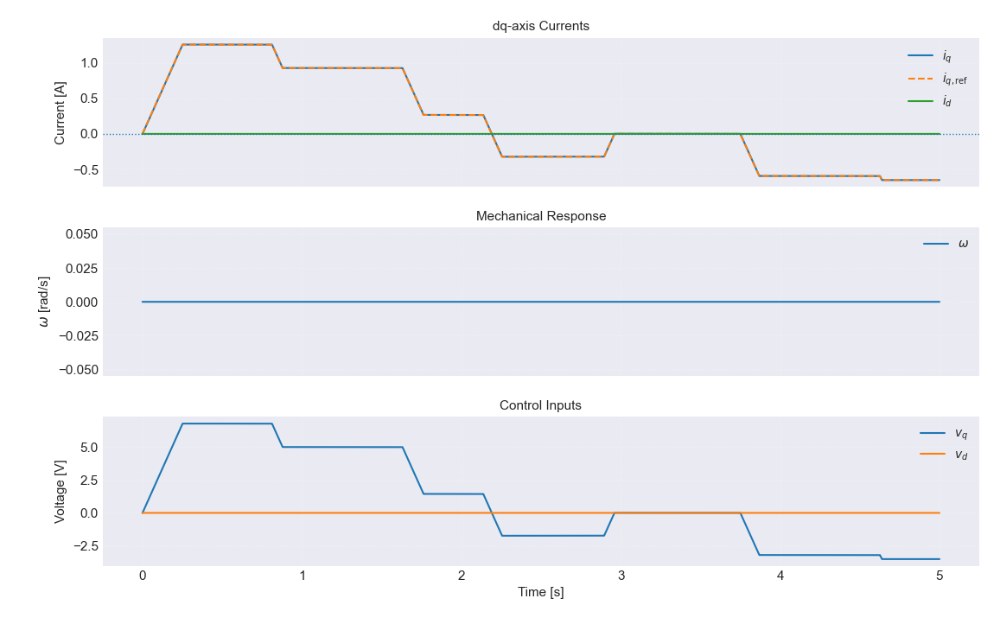
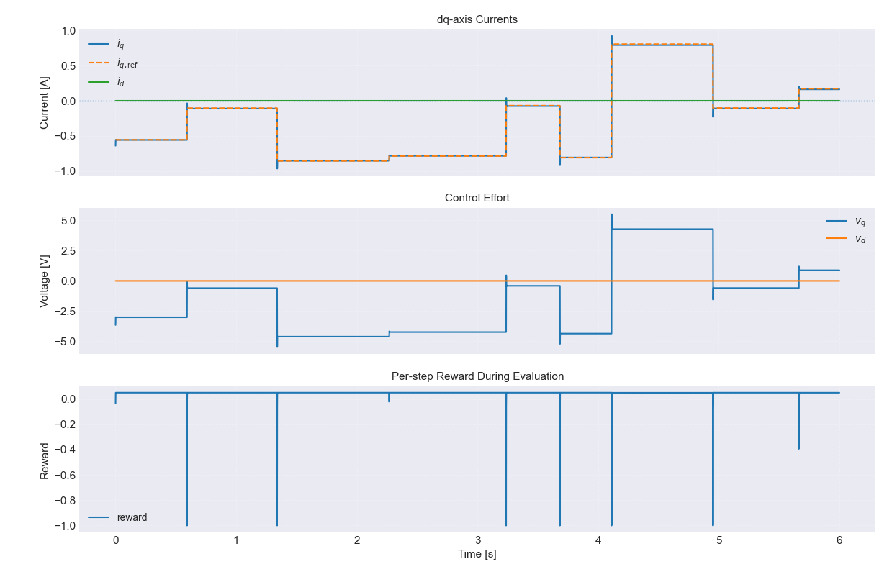
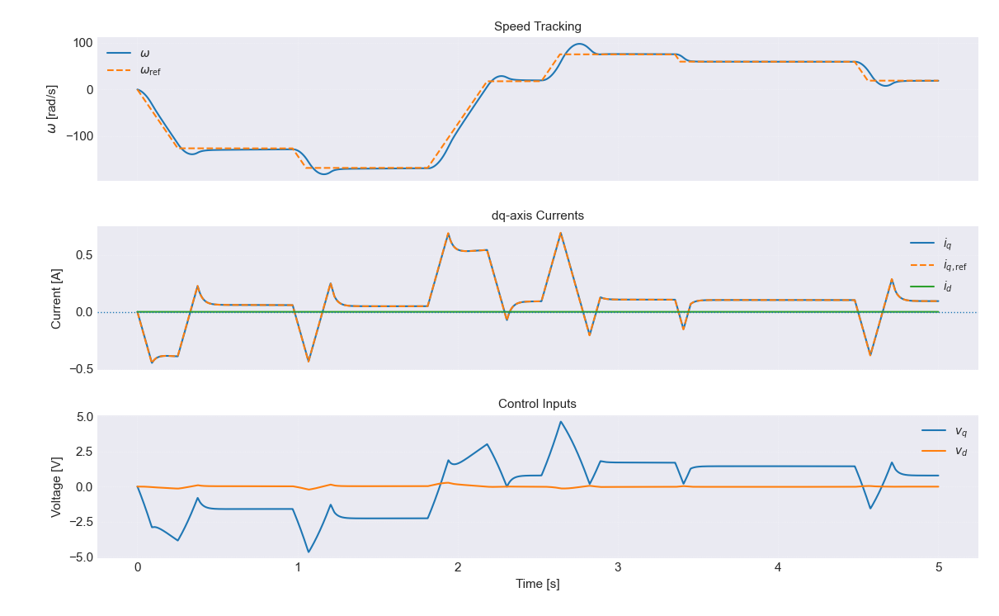
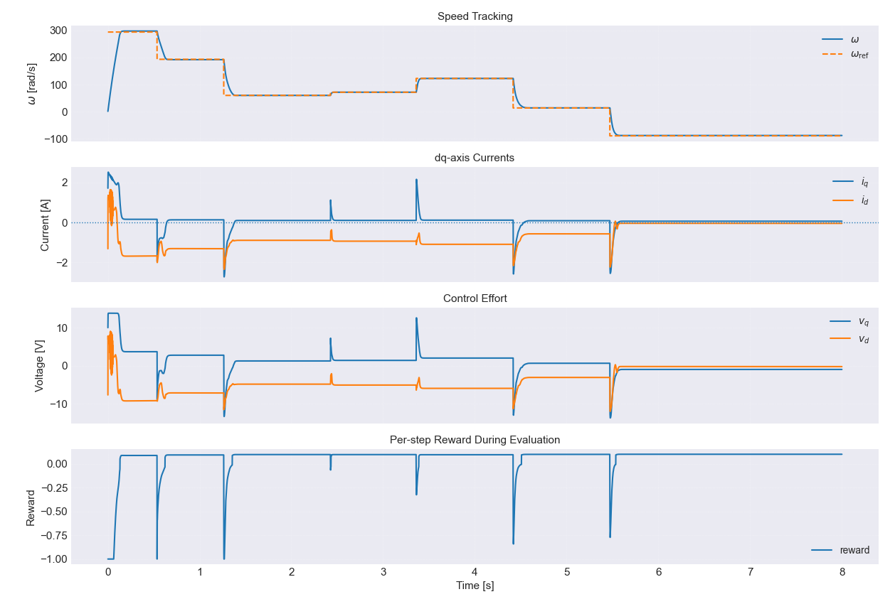

# Motor Control Benchmark Suite


A compact simulation project for benchmarking **classical motor control** against **reinforcement learning based control** on two drive types:

- **DC motor**
- **Permanent Magnet Synchronous Motor (PMSM)**

The repository focuses on two canonical control problems:

- **current tracking**
- **speed tracking**

It is especially suited for thesis, SRS (TDK), and educational work where the goal is to compare **PI / FOC baselines** with **TD3-based RL controllers** under consistent simulation conditions.

---

## Highlights

- Classical **PI control** for DC motor current and speed loops
- Classical **FOC baseline** for PMSM current and speed control
- **TD3 reinforcement learning** controllers for current and speed tracking
- Standalone scripts with **minimal setup overhead**
- Continuous-time motor models integrated with **RK4**
- Practical nonidealities such as:
  - actuator lag
  - voltage saturation
  - friction
  - load torque
  - randomized reference profiles
- Built-in plotting and evaluation summaries

---

## Repository Structure

```text
sim_DC_PI.py              # Classical DC motor PI baseline
sim_DC_RL_Current.py      # TD3-based RL for DC motor current control
sim_DC_RL_Speed.py        # TD3-based RL for DC motor speed control
sim_PMSM_FOC.py           # Classical PMSM FOC baseline
sim_PMSM_RL_Current.py    # TD3-based RL for PMSM current control
sim_PMSM_RL_Speed.py      # TD3-based RL for PMSM speed control
```

---

## What Each Script Does

### Classical baselines

#### `sim_DC_PI.py`
A DC motor simulator with classical PI control. Supports:

- `--mode speed`
- `--mode current`
- fixed or random references
- actuator lag
- rotor lock option
- voltage and integrator limits

This script is the main **classical baseline** for the DC case.

#### `sim_PMSM_FOC.py`
A PMSM simulator with classical field oriented control. Supports:

- `--mode speed`
- `--mode current`
- random references
- rotor lock option
- current limits
- voltage saturation handling
- base-speed style logic for field-weakening related operation

This is the main **classical baseline** for the PMSM case.

### RL controllers

#### `sim_DC_RL_Current.py`
TD3-based RL environment for **DC motor current tracking**.

Key characteristics:
- Gymnasium environment
- continuous action space
- randomized current references
- actuator dynamics
- reward shaping for tracking and control smoothness
- saves model as `dc_rl_current`

#### `sim_DC_RL_Speed.py`
TD3-based RL environment for **DC motor speed tracking**.

Key characteristics:
- randomized speed profile generation
- current and speed included in observation
- continuous voltage command action
- reward shaping with tracking and effort penalties
- saves model as `dc_rl_speed`

#### `sim_PMSM_RL_Current.py`
TD3-based RL controller for **PMSM current tracking**.

Key characteristics:
- train / eval interface
- optional `--free_rotor` mode
- saves model as `pmsm_rl_current`

#### `sim_PMSM_RL_Speed.py`
TD3-based RL controller for **PMSM speed tracking**.

Key characteristics:
- train / eval interface
- PMSM speed tracking benchmark
- saves model as `pmsm_rl_tracking`

---

## Installation

### 1. Create a virtual environment

```bash
python -m venv .venv
source .venv/bin/activate
```

On Windows:

```bash
.venv\Scripts\activate
```

### 2. Install dependencies

```bash
pip install numpy matplotlib gymnasium stable-baselines3
```

Depending on your Python environment, you may also want:

```bash
pip install torch
```

---

## Quick Start

### Classical DC baseline

Run DC speed control:

```bash
python sim_DC_PI.py --mode speed
```

Run DC current control with random reference:

```bash
python sim_DC_PI.py --mode current --random_ref --lock_rotor
```

### Classical PMSM baseline

Run PMSM speed control:

```bash
python sim_PMSM_FOC.py --mode speed
```

Run PMSM current control:

```bash
python sim_PMSM_FOC.py --mode current --random_ref
```

### Train RL controllers

```bash
python sim_DC_RL_Current.py --train
python sim_DC_RL_Speed.py --train
python sim_PMSM_RL_Current.py --train
python sim_PMSM_RL_Speed.py --train
```

### Evaluate trained models

```bash
python sim_DC_RL_Current.py --eval
python sim_DC_RL_Speed.py --eval
python sim_PMSM_RL_Current.py --eval
python sim_PMSM_RL_Speed.py --eval
```

PMSM current RL also supports:

```bash
python sim_PMSM_RL_Current.py --train --free_rotor
python sim_PMSM_RL_Current.py --eval --free_rotor
```

---

## Main Command-Line Options

### `sim_DC_PI.py`

Important options include:

- `--mode {speed,current}`
- `--random_ref`
- `--lock_rotor`
- `--t_end`
- `--dt`
- `--Vdc`
- `--Tload`
- `--tau_act`
- `--w_ref`, `--i_ref`
- `--w_ref_min`, `--w_ref_max`
- `--i_ref_min`, `--i_ref_max`
- `--Kp_w`, `--Ki_w`
- `--Kp_i`, `--Ki_i`

### `sim_PMSM_FOC.py`

Important options include:

- `--mode {speed,current}`
- `--random_ref`
- `--dt`
- `--t_end`
- `--Vdc`
- `--w_ref`
- `--Tload`
- `--Imax`
- `--base_speed`
- `--lock_rotor`
- `--Kp_id`, `--Ki_id`
- `--Kp_iq`, `--Ki_iq`
- `--Kp_w`, `--Ki_w`

### RL scripts

The RL scripts primarily use:

- `--train`
- `--eval`

And for PMSM current RL:

- `--free_rotor`

---

## Typical Workflow

A typical comparison study looks like this:

1. Run the **classical baseline** for a given task.
2. Train the corresponding **RL controller**.
3. Evaluate both on similar reference trajectories.
4. Compare:
   - tracking error
   - overshoot behavior
   - control effort
   - smoothness of voltage commands
   - final response quality
   - reward trends in RL runs

This structure makes the repository useful for side-by-side benchmarking rather than only standalone controller testing.

---

## Output and Evaluation

The scripts generate time-domain plots and console summaries. Depending on the selected file, outputs typically include:

- reference trajectory
- motor current
- speed response
- control voltage
- torque response
- reward history or reward diagnostics

The RL evaluation scripts also print summary metrics such as:

- mean absolute tracking error
- maximum absolute tracking error
- mean control magnitude
- final speed
- mean step reward

---

## Example Results Section

### DC current control
- Classical PI controller provides a strong baseline with predictable behavior and easy tuning.



*Figure 1. Current tracking performance of the PI controller on the DC motor.*
- RL controller can reduce tracking error in some scenarios while learning smoother or more adaptive control actions depending on reward design.



*Figure 2. Current tracking performance of the RL controller on the DC motor.*
### DC speed control
- The PI cascade gives an interpretable industrial baseline.



*Figure 3. Speed tracking performance of the PI controller on the DC motor.*
- The RL speed controller is useful for studying whether a learned policy can match or exceed the baseline under changing references and load conditions.


*Figure 4. Speed tracking performance of the RL controller on the DC motor.*
### PMSM current control
- FOC remains the standard reference approach for dq current regulation.


*Figure 5. Current tracking performance of the PI controller on the PMSM motor.*
- RL offers an alternative policy-learning framework, especially interesting when nonidealities or changing operating modes are introduced.



*Figure 6. Current tracking performance of the RL controller on the PMSM motor.*
### PMSM speed control
- Classical speed-loop plus current-loop structure remains the benchmark.



*Figure 7. Speed tracking performance of the PI controller on the PMSM motor.*
- RL can be evaluated for robustness, smoothness, and multi-objective tradeoffs encoded through reward shaping.



*Figure 8. Speed tracking performance of the RL controller on the PMSM motor.*

---

## Saved Models

Training produces local model files with the following names:

- `dc_rl_current`
- `dc_rl_speed`
- `pmsm_rl_current`
- `pmsm_rl_tracking`

Run evaluation only after the corresponding model has been trained and saved.

---

## Technical Notes

- The project is organized as **standalone scripts**, not as a packaged library.
- Parameters are embedded directly in the files for fast experimentation.
- Numerical integration is based on **RK4**.
- RL controllers use **TD3** through Stable-Baselines3.
- The focus is on **simulation benchmarking**, not direct deployment.

---

## Use Cases

This repository is suitable for:

- thesis and TDK work
- motor-control education
- benchmarking RL against classical control
- studying reward shaping in control tasks
- generating figures for reports and presentations
- rapid testing before more advanced hardware-oriented work

---

## Limitations

- No unified package structure yet
- No central configuration file
- No automated benchmark runner
- No CSV export pipeline by default
- Comparisons are meaningful, but not a formal standardized benchmark suite yet

---

## Future Improvements

Possible next steps:

- add a unified config system
- save metrics automatically to CSV
- create reproducible benchmark scenarios
- add noise and parameter uncertainty sweeps
- export publication-ready plots automatically
- extend to hardware-in-the-loop or embedded deployment studies

---

## License

This project is licensed under the **MIT License**.

---

## Author Notes

This project is best understood as a **research and educational benchmark suite** for comparing **classical control** and **reinforcement learning** in electric drive simulations.
